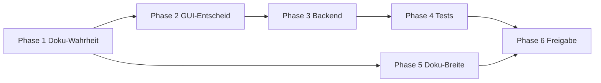

# MASTER_REMEDIATION_PLAN – Gap-Schließung Linux Desktop Chat

**Stand:** 2026-03-20  
**Grundlage:** `docs/STATUS_AUDIT.md`, `docs/PLACEHOLDER_INVENTORY.md`, `docs/DOC_PROMISE_MISMATCH_REPORT.md`, `docs/IMPLEMENTATION_GAP_MATRIX.md`, `docs/TEST_GAP_REPORT.md`  
**Scope:** Umsetzungsplanung **ohne** Codeänderungen in diesem Schritt.

---

## 1. Executive Summary

Die Codebasis ist in Kernpfaden (Chat, Kontext, Agenten-HR im Control Center, Prompts, RAG, Settings-Kategorien 1–6, QA Command Center) **weit produktionsreif**. Die Audit-Reports bündeln die Schließungsbedarfe in fünf Cluster:

1. **Doku vs. Ist** – Architekturtexte und QA-Evaluierungen beschreiben teils noch `app/ui/`, Demo-Agenten im CC und fehlende `AgentService`-Anbindung; der **aktuelle** CC-Agents-Tab nutzt `AgentManagerPanel` mit `AgentService`. Zusätzlich ist `docs/DOC_GAP_ANALYSIS.md` in mehreren BLOCKER-/HIGH-Punkten **überholt**.
2. **Irreführende oder leere GUI** – Control Center **Tools** und **Data Stores** mit `dummy_data`; **Dashboard**-Screen mit vier Panels ohne Backend; diverse **(Platzhalter)**-Labels in Knowledge, Prompt Studio, Agent Tasks; **totes** `agents_panels.py`-Demo; **Doppelname** `AgentRegistryPanel`.
3. **Backend-Anbindung** – Keine Service-Verdrahtung für CC-Tools/Data-Store-Übersicht ersichtlich; **Project/Workspace-Settings** ohne Felder; **Pipeline** ComfyUI/Media nur Platzhalter-Executor; **`critic.py`** unklar.
4. **Tests** – Vollständige **`pytest --collect-only`** fehlgeschlagen (30 Collection-Errors); Lücken für CC-Dummy-Panels, Dashboard, Placeholder-Executor-Verhalten, Doku-Drift-Regression.
5. **Doku-Lücken** – Root-`README.md` vs. realer CC-Stand (Tools/Data Stores); **CLI / Repro-Registry** dünn dokumentiert; historische Reports mit `app/ui/`-Pfaden.

**Strategie:** Zuerst **Wahrheit herstellen** (Doku + sichtbare UX-Kennzeichnung), dann **pro Produktentscheidung** entweder **verdrahten** oder **bewusst stilllegen**, danach **Tests und Freigabe**. Kein Architektur-Umbau über diese Befunde hinaus.

---

## 2. Leitprinzipien

| Prinzip | Konkretisierung |
|---------|-----------------|
| **Befundgetrieben** | Jede Arbeitspaket-ID im Backlog referenziert mindestens eine Quelle aus den genannten Reports. |
| **Kein Scope-Kreep** | Keine neuen Produktfeatures außerhalb der dokumentierten Lücken (z. B. kein neues „AI Studio“-Konzept). |
| **Ehrliche UI** | Solange keine Live-Daten existieren: **klar als Vorschau / nicht verbunden** kennzeichnen oder Eintrag aus Navigation entfernen – siehe STATUS_AUDIT „irreführende Daten“. |
| **Eine kanonische Wahrheit** | CC-Agenten = `agents_ui`; Entfernen oder Umbenennen des toten `agents_panels.py`-Pfads zur Vermeidung von Doppel-`AgentRegistryPanel` (PLACEHOLDER_INVENTORY, STATUS_AUDIT). |
| **Architekturkonform** | GUI → Services → Provider/DB; keine neuen Querschnitte ohne Notwendigkeit (IMPLEMENTATION_GAP_MATRIX). |
| **QA-first Abschluss** | Jede Phase hat **objektive DoD**; Gesamtfreigabe nur bei definierter Test- und Doku-Baseline (siehe `docs/QA_ACCEPTANCE_MATRIX.md`). |

---

## 3. Gesamtpriorisierung

| Rang | Thema | Begründung (Report) |
|------|--------|---------------------|
| **P0** | Falsche Architektur-/Agenten-Doku, veraltete DOC_GAP_BLOCKER | Fehlsteuerung von Entwicklung und Onboarding (DOC_PROMISE_MISMATCH, STATUS_AUDIT §Doku) |
| **P0** | CC Tools / Data Stores + Dashboard: irreführende „Live“-Wirkung | UX-/Vertrauensrisiko, QA-UX-Reports (STATUS_AUDIT Hauptrisiko 1, PLACEHOLDER_INVENTORY) |
| **P1** | Test-Collection stabilisieren | Kein belastbares Gate ohne grüne Collection (TEST_GAP_REPORT) |
| **P1** | Totes `agents_panels.py`, Namenskollision | Wartungs- und Leserisiko (STATUS_AUDIT Architektur) |
| **P2** | Knowledge / Prompt / Agent-Task-Platzhalter-Panels | Teilweise; Backend oft vorhanden (IMPLEMENTATION_GAP_MATRIX) |
| **P2** | Settings Project/Workspace | Entweder erste Keys oder Nav-Einschränkung + Doku (GAP_MATRIX, PLACEHOLDER_INVENTORY) |
| **P2** | Pipeline Placeholder-Executors + Erwartungssteuerung | Bereits konsistent mit `FEATURES/chains.md` – Tests und UI/Doku abstimmen |
| **P3** | `critic.py`, `command_center_view` Subsystem-Placeholder-Kommentar | Unklar/niedrig – erst Verifikation (STATUS_AUDIT) |
| **P3** | `workspace_graph` EN-Text, Markdown-Demo-Kommunikation | Niedrig (PLACEHOLDER_INVENTORY) |
| **P3** | CLI-/Deployment-Doku | DOC_GAP offene Lücken |

---

## 4. Phasenplan (Überblick)

| Phase | Name | Ziel (Kurz) |
|-------|------|-------------|
| **1** | Kritische Widersprüche Doku ↔ Anwendung | Kanonische Pfade und CC-Agenten-Beschreibung; DOC_GAP Bereinigung; README/CC-Lücke |
| **2** | GUI-Platzhalter & tote Verzweigungen | CC Tools/Data Stores + Dashboard: kennzeichnen, verbergen oder ersetzen; Legacy `agents_panels`; UX-Konsistenz |
| **3** | Backend-Lücken & Verdrahtung | Services/Health für Phase-2-Entscheidungen; Knowledge/Prompt/Agent-Task-Daten; Settings/Pipeline/critic je nach Entscheid |
| **4** | Testabdeckung | Collection-Errors beheben; neue Tests für geänderte Flächen; Regression Doku-vs-Code |
| **5** | Dokumentationskonsolidierung | CLI/Repro, Archiv-Hinweise auf `app/ui/`-Reports, optional Deployment |
| **6** | Gesamt-QA & Release-Freigabe | Matrix abarbeiten, Sign-off-Regeln |

Detail mit Aufgaben, Risiken und DoD: **`docs/PHASE_BREAKDOWN.md`**.  
Arbeitsliste: **`docs/EXECUTION_BACKLOG.md`**.

---

## 5. Abhängigkeiten

- **Phase 2 hängt von Phase 1 ab:** Produkt-/UX-Texte („Vorschau“ vs. „Live“) müssen mit korrigierter Doku und README aligned sein.  
- **Phase 3 hängt von Phase 2 ab:** Technische Verdrahtung nur sinnvoll nach Entscheid **implementieren vs. deaktivieren** pro Fläche.  
- **Phase 4** parallelisierbar mit Phase 5 nach Beginn von Phase 3 (Tests für neue Module).  
- **Phase 6** blockiert, bis Phase 4 **und** relevante Phase-5-Punkte für Freigabe erfüllt sind.

---

## 6. Risiko-Management

| Risiko | Quelle | Maßnahme |
|--------|--------|----------|
| Überimplementierung von CC-Tools/Data Stores | IMPLEMENTATION_GAP_MATRIX „Hoch“ ohne Product Owner | Phase 2: **Entscheidungs-Workshop** (max. 1 Seite Ergebnis): Live-Daten vs. ausgeblendet vs. nur Label „Demo“ |
| Test-Collection-Errors umgebungsbedingt | TEST_GAP_REPORT | CI-Matrix dokumentieren (Python-Version, optional deps); fehlende Pakete als `pytest.ini`/markers oder skips mit Begründung |
| Namenskonflikt `AgentRegistryPanel` bei Refactor | STATUS_AUDIT | Umbenennung nur mit Architektur-Guard-Update (`test_gui_does_not_import_ui.py` etc.) |
| Pipeline-Nutzer erwarten Comfy/Media | PLACEHOLDER_INVENTORY | Doku + UI: „nicht verfügbar“ explizit; Executor-Tests für Fehlerpfad |
| Doppelte „Kommandozentrale“ | STATUS_AUDIT | Phase 2/5: Navigation oder Titel angleichen bzw. Dashboard bis zur Anbindung als „Übersicht (in Arbeit)“ |

---

## 7. Abnahmekriterien je Phase

Siehe **`docs/PHASE_BREAKDOWN.md`** (pro Phase **Definition of Done**).

Kern jeweils:

- **Phase 1:** Liste der korrigierten Dateien aus DOC_PROMISE_MISMATCH; keine offenen P0-Widersprüche zu `agents_workspace.py` / `app/gui/domains/command_center/`.  
- **Phase 2:** Keine CC-Tools/Data-Stores-/Dashboard-Elemente, die **ohne Kennzeichnung** als produktive Live-Daten lesbar sind – **oder** Navigationseinträge entfernt.  
- **Phase 3:** Für jede in Phase 2 als „Live“ markierte Fläche existiert nachvollziehbare Service-/Datenquelle; Settings/Pipeline gemäß Entscheid.  
- **Phase 4:** `pytest --collect-only` grün in Referenz-CI; neue Tests für geänderte Module grün.  
- **Phase 5:** DOC_GAP aktualisiert; CLI/Repro mindestens eine kanonische Dev-Doku; kritische `app/ui/`-Reports mit Archiv-Verweis oder Pfadfix.  
- **Phase 6:** `docs/QA_ACCEPTANCE_MATRIX.md` vollständig erfüllt für gewählte Release-Stufe.

---

## 8. Gesamtfreigabekriterien

Die **Gesamtfreigabe** (Release- oder interne „audit-closed“-Meile) gilt als erfüllt, wenn **kumulativ**:

1. **Wahrheit in Doku:** Keine offenen Einträge aus `DOC_PROMISE_MISMATCH_REPORT.md` der Kategorie „falscher Ist-Zustand“ ohne Ticket-Nachweis oder Archiv-Markierung.  
2. **Keine kritischen UI-Täuschungen:** CC Tools, Data Stores, Dashboard entsprechen der in Phase 2 dokumentierten Strategie (Live / Demo-labeled / hidden).  
3. **Technische Integrität:** `agents_panels`-Duplikat bereinigt oder formal als unbenutzt verifiziert und Doku angepasst (STATUS_AUDIT).  
4. **Tests:** Referenz-CI: `pytest` Collection erfolgreich; definierte Regressionssuite (Chat, Kontext, Markdown, Architektur-Guards) grün; neue Tests für alle Phase-2/3-geänderten Pfade aus Backlog erfüllt.  
5. **QA-Matrix:** Alle als **Release-blockierend** markierten Zeilen in `docs/QA_ACCEPTANCE_MATRIX.md` mit Nachweis erfüllt.  
6. **Restrisiken dokumentiert:** z. B. fehlendes Live-Ollama-E2E, optional fehlende Deployment-Doku – explizit in Release-Notes oder verbleibendem DOC_GAP-Abschnitt „accepted“.

---

## Verweise

| Dokument | Rolle |
|----------|--------|
| `docs/PHASE_BREAKDOWN.md` | Phasen-Detail, Module, Risiken, DoD |
| `docs/EXECUTION_BACKLOG.md` | Umsetzbare Tickets mit IDs |
| `docs/QA_ACCEPTANCE_MATRIX.md` | Objektive Prüf- und Freigabekriterien |

---

*Ende MASTER_REMEDIATION_PLAN*
