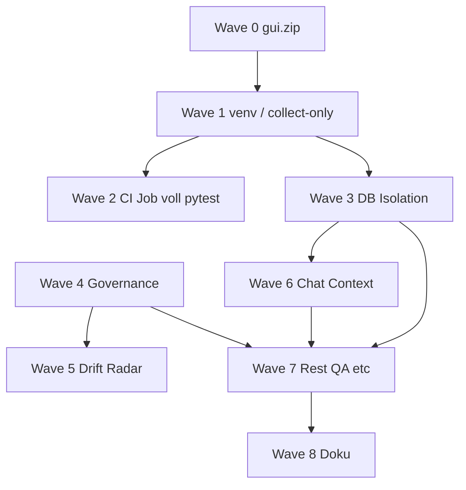

# STABILIZATION_PLAN – Linux Desktop Chat

**Rolle:** Principal Architect / Stabilität  
**Stand:** 2026-03-21  
**Grundlage:** `docs/RELEASE_BLOCKER_LIST.md`, `docs/FINAL_QA_ACCEPTANCE_REPORT.md`, `docs/FINAL_RECOMMENDATION.md`  
**Scope:** Stabilität, Konsistenz, Testbarkeit – **kein** Feature-Ausbau, **kein** Redesign.

---

## Zielbild (messbar)

| Ziel | Kriterium |
|------|-----------|
| Deterministische Ausführung | Gleicher Checkout + gleiche Schritte → gleicher pytest-Exit-Code |
| Vollständige Testbarkeit | `pip install -r requirements.txt` in Referenz-venv → **`pytest --collect-only` ohne Fehler** |
| Grüne Gesamtsuite | **`pytest` (Repo-Root, ohne Marker-Ausschluss)** → Exit 0 **oder** schriftlich fixierte **Teilmenge** (siehe `STABILIZATION_STRATEGY.md`) |
| Architekturkonformität | Alle **aktiven** Guards grün **oder** Policy-Update mit explizitem „kanonisch neu“ |
| Reproduzierbarer Start | README / Developer Guide: **ein** empfohlener Weg (venv, Install, Test, App-Start) |

---

## Priorisierte Reihenfolge (Waves)

Die Reihenfolge maximiert **frühe Entblockierung**, minimiert **Rework** und trennt **triviale Hygiene** von **Verhaltens- und Architekturentscheidungen**.

### Wave 0 – Hygiene (sofort, kein Verhaltensrisiko)

**Zweck:** Einen objektiven Guard und Repo-Rauschen beseitigen.  
**Blocker:** RB-02  

- Entfernen oder Auslagern von `app/gui.zip` (nicht im `app/`-Root gemäß `test_app_package_guards`).

**Abhängigkeiten:** keine.  
**Ergebnis:** Guard `test_app_package_guards` kann für Dateiliste grün werden.

---

### Wave 1 – Test-Infrastruktur & reproduzierbare Umgebung

**Zweck:** Collection-Fehler und „works on my machine“ eliminieren.  
**Blocker:** RB-05  

- Referenzweg **erzwingen** (Doku + optional `Makefile`/Skript): `python3 -m venv .venv` → `pip install -r requirements.txt` → `pytest`.
- Optional: Hinweis in `pytest.ini`/`conftest` nur, wo **ohne** Scope-Shift möglich (z. B. klarer Fehlertext bei fehlendem `qasync`, **ohne** stilles Installieren).
- **`pytest --collect-only`** als lokaler und CI-Schritt dokumentieren.

**Abhängigkeiten:** Wave 0 empfohlen (sauberer Stand), aber nicht zwingend.  
**Ergebnis:** QA-14-kompatibler Referenzpfad ist **eindeutig** und **nachprüfbar**.

---

### Wave 2 – CI-Integration (vollständige Suite)

**Zweck:** Kein Teil-Testing mehr als **alleinige** Qualitätsrealität.  
**Blocker:** RB-06  

- Neuer GitHub-Actions-Job: Checkout → Python 3.12 (wie bestehende Workflows) → `pip install -r requirements.txt` → **`pytest`** (gesamt).
- **Branch-Policy:** Job ist **required**, sobald die Suite lokal grün ist; bis dahin kann der Job temporär laufen, um den Fortschritt sichtbar zu machen (Teamentscheid – siehe Strategie).

**Abhängigkeiten:** Wave 1 (stabile Installationsannahme). **Inhaltlich** hängt Grün von Wave 3–6 ab – der Job kann zuerst **rot** sein, muss aber existieren.  
**Ergebnis:** Kein versteckter Regressionszustand mehr.

---

### Wave 3 – DB- und Test-Isolation

**Zweck:** `readonly database` und damit verbundene Flakes/False Negatives beseitigen.  
**Blocker:** RB-07, RB-01 (Teilmenge)  

- Einheitliche Strategie für **SQLite-Pfade** in Tests: temporäres Verzeichnis, beschreibbare Datei, pro Testsession oder pro Test **deterministisch** wählen (konkrete Umsetzung im Backlog).
- Fixtures so ausrichten, dass **kein** Test gegen eine **read-only** Produkt-DB schreibt, sofern das nicht explizit der Testgegenstand ist.

**Abhängigkeiten:** Wave 1.  
**Ergebnis:** Persistenztests (`test_app`, `test_db_files`, `test_projects`, …) werden **reproduzierbar**.

---

### Wave 4 – Architektur-Governance (Imports, EventBus, Provider)

**Zweck:** Guards und Realität **entweder** angleichen **oder** Policy formal ändern.  
**Blocker:** RB-03, RB-01 (Architektur-Teil)  

- Bündel entscheiden (siehe `STABILIZATION_STRATEGY.md`):
  - `core/chat_guard` → Imports zu `rag` / `services`
  - `app/context/engine.py` → `emit_event`
  - `services/provider_service.py` → direkter `CloudOllamaProvider`-Import

**Abhängigkeiten:** Strategie-Sign-off; technisch parallel zu Wave 3 möglich, logisch **vor** finalem CI-Grün sinnvoll.  
**Ergebnis:** Governance-Tests **deterministisch grün** mit dokumentierter Begründung.

---

### Wave 5 – Drift-Radar (Timeout / Instabilität)

**Zweck:** `test_architecture_drift_radar` zuverlässig machen.  
**Blocker:** RB-04, RB-01 (Teil)  

- Ursache klären: Laufzeit des Skripts, I/O, Graphgröße, Endlosschleife.
- Maßnahme **ohne Feature-Shift:** Timeout erhöhen nur mit **Obergrenze** und **Profiling**; bevorzugt **Skript optimieren** oder Test in **separaten, selteneren** Job verschieben **nur** wenn Strategie das erlaubt.

**Abhängigkeiten:** Wave 4 optional (Drift kann Architekturgraph berühren).  
**Ergebnis:** Test **endet deterministisch** innerhalb festgelegter Zeit.

---

### Wave 6 – Chat / Kontext-Konsistenz (Code ↔ Tests)

**Zweck:** Widersprüchliche Erwartungen beseitigen.  
**Blocker:** RB-01 (Chat, Struktur, Policy-Tests laut Abschlussbericht)  

- Sollverhalten **einmal** festlegen (Kontext-Injektion: Anzahl Messages, Präfixe wie `Kontext:`, Profile vs. Hint vs. Policy).
- Dann **entweder** Produktcode **oder** Tests anpassen – gemäß Strategie „wer gewinnt“, nicht beides widersprüchlich.

**Abhängigkeiten:** Wave 3 (stabile DB/Settings in Tests); fachlich unabhängig von Wave 4, aber Gesamtlauf erst danach grün.  
**Ergebnis:** `tests/chat/*`, `tests/structure/test_chat_context_injection.py` und verwandte Fälle **ohne** widersprüchliche Annahmen.

---

### Wave 7 – Restfailures (QA-Artefakte, Failure-Modes, Sonstiges)

**Zweck:** verbleibende rote Tests aus dem Abschlussbericht schließen.  
**Blocker:** RB-01 (Rest)  

- `tests/qa/coverage_map/...` / fehlende `QA_TEST_INVENTORY.json` im Test-Setup → Fixture oder eingechecktes Minimal-Artefakt (reine Testdaten, kein Produktfeature).
- `test_prompt_service_failure`, `test_semantic_enrichment`, weitere Einzelfälle → je Ursache (Mock, DB, Erwartungsliste).

**Abhängigkeiten:** Wave 3–6.  
**Ergebnis:** **`pytest` gesamt grün** (oder definierte Teilmenge).

---

### Wave 8 – Doku-Konsistenz (Stabilisierungsrelevant)

**Zweck:** Audit- und Onboarding-Wahrheit; **kein** neuer Umfang.  
**Blocker:** RB-08, RB-09  

- `DOC_GAP_ANALYSIS.md`: widersprüchliche Abschnitte bereinigen.
- `IMPLEMENTATION_GAP_MATRIX.md`: CC Tools/Data Stores/Dashboard auf Ist-Stand.

**Abhängigkeiten:** kann parallel zu Wave 7 laufen.  
**Ergebnis:** Dokumentation widerspricht nicht mehr dem stabilisierten System.

---

## Abhängigkeitsgraph (vereinfacht)

**Hinweis:** Wave 2 (CI) kann **parallel** zu Wave 3–7 aktiviert werden, sobald Wave 1 steht; **required merge gate** erst bei grüner Suite sinnvoll.

---

## Definition of Done (Gesamt-Stabilisierung)

- `pytest --collect-only` und `pytest` gemäß Zielbild **grün** auf Referenz-OS (Linux) in frischer venv.
- GitHub Actions führt **dieselbe** pytest-Konfiguration aus.
- Keine offenen RB-01–RB-07 ohne dokumentierte Ausnahme (Teilmengen-Strategie).
- `STABILIZATION_BACKLOG.md`: alle P0-Einträge **Done** oder **Won’t fix** mit Verweis auf Strategie.

---

*Ende STABILIZATION_PLAN*
