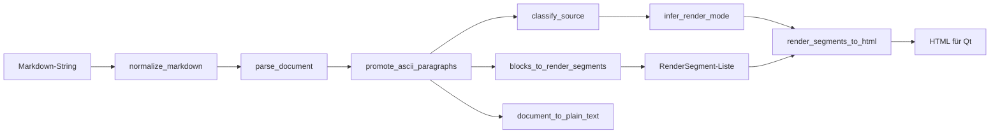

# Markdown-Rendering-Architektur (GUI)

## Ziel

Ein **GUI-weites**, **deterministisches** Markdown-Rendering ohne verteilte Regex-Inseln: gleiche Pipeline für Chat, Hilfe und künftige Text-/Info-Panels. Schwerpunkt: **ASCII-stabile Darstellung** (Diagramme, CLI-Ausgaben, Pseudotabellen) in **Monospace-Blöcken**, getrennt von proportionalem Fließtext.

## Komponenten

| Modul | Rolle |
|--------|--------|
| `app/gui/shared/markdown/markdown_types.py` | AST-Daten (`MarkdownDocument`, Blöcke, `RenderMode`, `RenderTarget`, `ContentProfile`, `RenderResult`) |
| `app/gui/shared/markdown/markdown_parser.py` | **Parsing**: zeilenbasierter Block-Parser (Überschriften, Absätze, Listen, Zitate, HR, Tabellen-Fallback, eingezäunte/eingerückte Codeblöcke) |
| `app/gui/shared/markdown/markdown_normalizer.py` | **Normalisierung**: `normalize_markdown` (CRLF/LF, Tabs→Spaces); `promote_ascii_paragraphs` inkl. gemeinsames Dedent |
| `app/gui/shared/markdown/markdown_rules.py` | **Erkennung**: `classify_source`, aggressive ASCII-Heuristik (Strukturzeichen, CLI, Einrückung), `infer_render_mode` |
| `app/gui/shared/markdown/markdown_segment_types.py` | GUI-neutrale **`RenderSegment`**-Typen (`heading`, `paragraph`, `bullet_list`, `ordered_list`, `code_block`, `inline_code`, `quote`, `separator`, `ascii_block`, `plain_block`) + Inline-**Parts** |
| `app/gui/shared/markdown/markdown_inline.py` | Inline: `parse_inline_parts`, `parts_to_html`, `render_inline_markdown_to_html` |
| `app/gui/shared/markdown/markdown_segment_builder.py` | Block-AST → `list[RenderSegment]` |
| `app/gui/shared/markdown/markdown_api.py` | **`parse_markdown`**, **`render_segments`** (ohne Qt) |
| `app/gui/shared/markdown/markdown_renderer.py` | **Segmente → HTML** für Qt (`render_segments_to_html`), Plaintext-Spiegel |
| `app/gui/shared/markdown/markdown_utils.py` | `escape_html` |
| `app/gui/shared/markdown/__init__.py` | u. a. `normalize_markdown`, `parse_markdown`, `render_segments`, `render_markdown`, `markdown_to_html` |

Keine neue schwere Markdown-Bibliothek: Parser und Renderer sind **eigenständig** und absichtlich **robust bei unvollständigem Markdown** (z. B. offenes Fence bis EOF).

## Datenfluss

1. **Parsing** baut ein `MarkdownDocument` aus Blöcken.  
2. **Normalisierung** kann mehrzeilige Absätze ohne Markdown-Hints bei hohem ASCII-Score in **`AsciiBlock`** überführen (Monospace-Pflicht).  
3. **Render-Modus** leitet sich aus Profil + Block-Mix ab.  
4. **Rendering** erzeugt Qt-taugliches HTML (Subset) und einen groben Plaintext-Spiegel.

## Render-Modi

| Modus | Bedeutung |
|--------|------------|
| `PLAIN_TEXT` | Kaum Struktur, Fließtext (escapet); im Chat: Zeilenumbrüche als ` ` |
| `RICH_TEXT` | Struktur + Inline-Formatierung, ohne Monospace-Blöcke |
| `PREFORMATTED` | Ein dominanter Monospace-Block (Fence, eingerückter Code, ASCII-Block) |
| `MIXED_DOCUMENT` | Kombination aus Fließtext-Blöcken und Monospace-Bereichen |

## RenderTarget (Kontext)

| Target | Verwendung |
|--------|------------|
| `HELP_BROWSER` / `GENERIC_HTML` | Hilfe, Dokumente: Absätze nach CommonMark-Logik **mit Leerzeichen** bei weichen Umbrüchen |
| `CHAT_BUBBLE` | Chat: **Zeilen innerhalb eines Absatzes** als ` `, damit Nutzer-Eingaben mehrzeilig lesbar bleiben |

Monospace-Blöcke nutzen **`white-space: pre-wrap`** und eine **Monospace-Schrift**, damit Einrückungen erhalten bleiben; bei sehr schmalen Chat-Spalten kann extrem breite ASCII-Kunst dennoch umbrechen (Qt-Limitierung ohne horizontale Scrollbar in der Bubble).

## Integrationspunkte

- **Chat**: `ChatMessageBubbleWidget` rendert über `render_markdown(..., RenderOptions(target=CHAT_BUBBLE))` → `QTextEdit.setHtml` (mit `updateGeometry`).  
- **Hilfe**: `HelpPanel`, `HelpWindow` nutzen `markdown_to_html()` aus derselben Pipeline.  
- **Weitere Panels**: `apply_to_qtext_edit` / `apply_to_qtext_browser` mit passendem `RenderTarget` und optional `promote_ascii=False` bei Bedarf.

Legacy-Hinweis: Die frühere `markdown_to_html`-Implementierung in `help_window.py` ist entfernt; Aufrufer importieren `app.gui.shared.markdown.markdown_to_html`.

## Erweiterung

Neue Features (z. B. verschachtelte Listen, striktes GFM) zuerst im **Parser** und in **Typen** modellieren, dann **Renderer** und **Tests** (`tests/unit/test_markdown_pipeline.py`) ergänzen — nicht in einzelnen Widgets.
