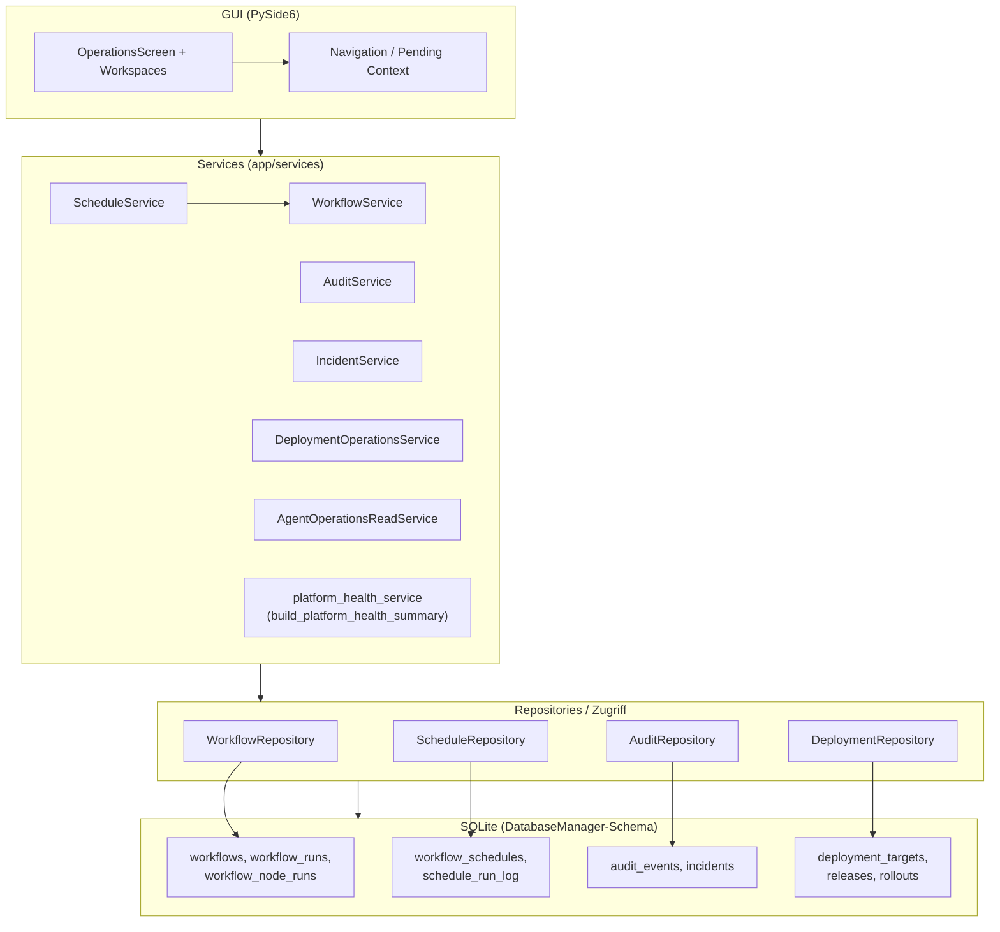
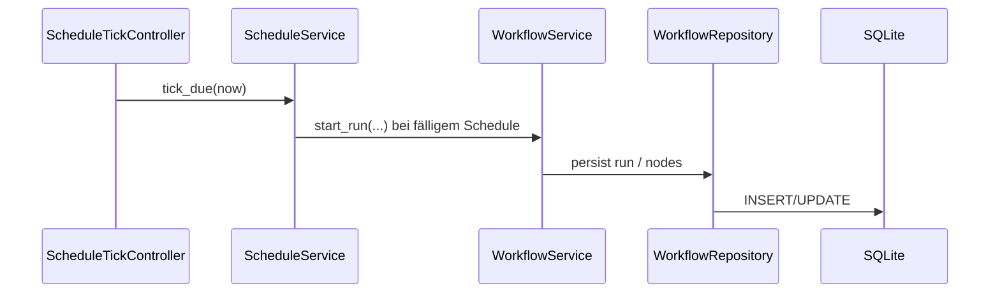
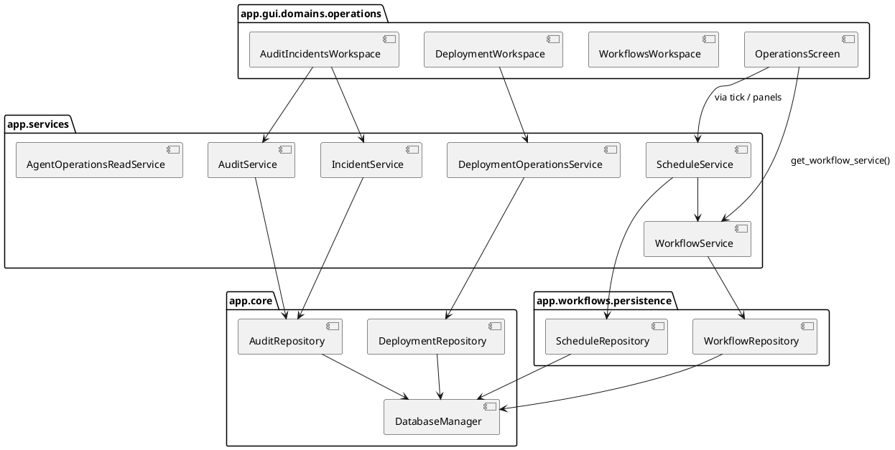

# Release-Architekturkarte — Linux Desktop Chat (Ist-Stand)

**Zielgruppe:** Entwickler, QA, Operatoren, Maintainer, technisch interessierte Dritte  
**Gültigkeit:** Beschreibt den **implementierten** Stand (keine Soll-Architektur).  
**Leitmuster:** **GUI → Services → Repository / SQLite**; ein gemeinsames App-DB-Schema (Datei z. B. `chat_history.db`, konfigurierbar).

---

## 1. Systemübersicht (oberste Ebene)

| Schicht | Rolle (Ist) |
|---------|-------------|
| **GUI** (`app/gui/`) | PySide6: Shell, Bereiche (Screens), Operations-Workspaces, Steuerung über Navigation, Pending Context / Workspace-Wechsel. |
| **Services** (`app/services/`) | Orchestrierung: lädt/speichert über Repositories, kapselt Fachabläufe (Chat, Workflows, Schedule, Audit, Deployment, …). |
| **Repositories / Persistenz** | Direkter SQLite-Zugriff in dedizierten Modulen (`WorkflowRepository`, `ScheduleRepository`, `AuditRepository`, `DeploymentRepository`, …) plus zentrales Anlegen/Migrieren des Schemas in `DatabaseManager`. |
| **Operations (Produkt)** | Fachliche Pakete O1–O4 (Workflows/Runs/Diagnose/Re-Run/Projektbezug) und R1–R4 (Audit/Incidents, Agent Ops + Platform Health, Scheduling, Deployment light) — **umgesetzt** über GUI-Workspaces + genannte Services + Tabellen. |

**Navigation / Kontext:** Zentrale Navigationsdefinition (`app/core/navigation/`), Resolver/Metadaten für Workspaces (`app/gui/navigation/workspace_graph_resolver.py`), Anzeige eines Workspaces über `OperationsScreen` + Stack. Deep Links / Pending Context setzen typischerweise Ziel-Area und `workspace_id` sowie optionale Parameter (z. B. Run-Auswahl).

---

## 2. GUI-Bereiche (Ist)

### 2.1 Operations-Screen (Haupteinstieg „Operations“)

Workspaces sind im Code an feste IDs gebunden (`operations_screen.py`):

| Workspace-ID | Produktname (Kurz) | Paketpfad (GUI) |
|--------------|-------------------|-----------------|
| `operations_projects` | Projekte | `…/operations/projects/` |
| `operations_chat` | Chat | `…/operations/chat/` |
| `operations_knowledge` | Knowledge (RAG) | `…/operations/knowledge/` |
| `operations_prompt_studio` | Prompt Studio | `…/operations/prompt_studio/` |
| `operations_workflows` | Workflows (Editor, Läufe, **Geplant**) | `…/operations/workflows/` |
| `operations_deployment` | Deployment (R4) | `…/operations/deployment/` |
| `operations_audit_incidents` | Betrieb: Audit, Incidents, Platform Health (R1/R2) | `…/operations/audit_incidents/` |
| `operations_agent_tasks` | Agent Tasks | `…/operations/agent_tasks/` |

Weitere **Hauptbereiche** außerhalb dieses Screens (gleiche App): u. a. **Kommandozentrale** (`command_center`), **Control Center**, **QA & Governance**, **Runtime / Debug**, **Settings** — jeweils eigene Screens unter `app/gui/domains/`.

---

## 3. Operations-Module (O1–O4, R1–R4) — Zuordnung

| Paket | Inhalt (Ist) | Typische GUI | Services / Module |
|-------|----------------|--------------|-------------------|
| **O1–O4** | Workflow-Definitionen, Run-Read-Model, Diagnose, Re-Run, projektbezogene Nutzung | `WorkflowsWorkspace`, Run-Panels | `WorkflowService`, `WorkflowRepository`, ggf. Hooks in Workflow-Lauf |
| **R1** | Audit-Events, Incidents (u. a. aus fehlgeschlagenen Läufen) | Tabs „Aktivität“, „Störungen“ in `AuditIncidentsWorkspace` | `AuditService`, `IncidentService`, `AuditRepository` |
| **R2** | Agent Operations (Lesen/Anzeige), Platform Health Checks | Agent-Tasks-Workspace; Tab „Plattform“ | `AgentOperationsReadService`, `platform_health_service` (`build_platform_health_summary`) |
| **R3** | Geplante Ausführungen, Tick triggert Läufe | Tab **Geplant** im Workflow-Workspace; `ScheduleTickController` (GUI-Takt) | `ScheduleService`, `ScheduleRepository` → **immer** `WorkflowService` für Start |
| **R4** | Targets, Releases, Rollouts (ohne externes Auto-Deploy) | `DeploymentWorkspace` | `DeploymentOperationsService`, `DeploymentRepository` |

---

## 4. Zentrale Services (Auswahl, real vorhanden)

| Service / API | Modul | Aufgabe (kurz) |
|---------------|--------|----------------|
| `WorkflowService` | `app/services/workflow_service.py` | Definitionen laden/speichern, Runs starten/auswerten, Diagnose/Re-Run-Pfade der Workflow-Schicht. |
| `ScheduleService` | `app/services/schedule_service.py` | CRUD/Logik für `workflow_schedules`; Ausführung nur via `WorkflowService.start_run`. |
| `AuditService` | `app/services/audit_service.py` | Audit-Events schreiben/lesen (über `AuditRepository`). |
| `IncidentService` | `app/services/incident_service.py` | Incidents anlegen/lesen, Verknüpfung mit Runs wo vorgesehen. |
| `DeploymentOperationsService` | `app/services/deployment_operations_service.py` | Targets/Releases/Rollouts für die GUI. |
| `AgentOperationsReadService` | `app/services/agent_operations_read_service.py` | Lesende Agent-Operations-Daten für UI. |
| **Platform Health** | `app/services/platform_health_service.py` | **Keine Klasse „PlatformHealthService“:** öffentliche Funktion `build_platform_health_summary()` aggregiert Probes (u. a. über `infrastructure_snapshot`). |

Weitere wichtige Services für den Gesamtproduktkern (nicht Operations-spezifisch): u. a. `ChatService`, `ProjectService`, `KnowledgeService`, `AgentService`, `ModelService` — weiterhin **GUI → Service → Persistenz/Extern**.

---

## 5. Persistenz (SQLite-Tabellen, Ist)

Schema-Erzeugung und Migrationen: `app/core/db/database_manager.py`.

**Operations-relevant (vom Release-Report genannt):**

| Tabelle | Zweck (Kurz) |
|---------|----------------|
| `workflows` | Gespeicherte Workflow-Definitionen (JSON/Metadaten). |
| `workflow_runs` | Lauf-Sätze (Read-Model für O1). |
| `workflow_node_runs` | Knotenläufe pro Run. |
| `workflow_schedules` | Geplante Ausführungen (R3). |
| `schedule_run_log` | Protokoll je Schedule-Tick/Lauf (R3). |
| `audit_events` | Audit-Trail (R1). |
| `incidents` | Störungen / Vorfälle (R1). |
| `deployment_targets` | Deployment-Ziele (R4). |
| `deployment_releases` | Releases mit Lifecycle (R4). |
| `deployment_rollouts` | Rollout-Protokoll; Feld **`workflow_run_id`** optional verknüpft (Ist-Modell). |

**Weitere** Kern-Tabellen derselben DB (Auszug): `chats`, `messages`, `projects`, … — Chat- und Projekt-Daten.

---

## 6. Datenflüsse (Beispiele, Ist)

```
GUI-Aktion (Button / Refresh / Tab)
    → Service-Methode (app/services/*)
        → Repository (SQL über sqlite3)
            → SQLite-Datei
```

**Konkrete Ketten:**

1. **Schedule (R3):** `ScheduleTickController` (Timer) → `ScheduleService.tick_due` → bei Fälligkeit **`WorkflowService.start_run`** → `WorkflowRepository` schreibt Run/Nodes → UI refresht über bestehende Panels.  
2. **Fehlgeschlagener Workflow-Lauf:** Run-Status in DB → **Incident**-Pfad über `IncidentService` / `AuditService` (wo im Code angebunden) → Anzeige unter **Betrieb → Störungen**.  
3. **Deployment-Rollout (R4):** GUI → `DeploymentOperationsService` → `DeploymentRepository` → Tabellen `deployment_*`; **`workflow_run_id`** kann gesetzt werden, ist **optional**.  
4. **Platform Health (R2):** GUI (`PlatformHealthPanel`) → Thread-Pool → `build_platform_health_summary()` → **keine** eigene Health-Tabelle; aggregiert bestehende Checks.

---

## 7. Visuelle Zielstruktur (Mermaid)

### 7.1 Schichten und Operations-Fokus



### 7.2 Scheduling → ein einziger Run-Orchestrator



---

## 8. PlantUML-Skizze (Paketebene, optional)



---

## 9. Modulverantwortlichkeiten (Auszug)

**Format:** `Modul` → **Verantwortung**

| Modul | Verantwortung |
|--------|----------------|
| `app/gui/domains/operations/operations_screen.py` | Stapel aller Operations-Workspaces; Wechsel per `workspace_id`. |
| `app/gui/domains/operations/workflows/` | Workflow-Editor, Run-Read-Model, Diagnose/Re-Run-UI, Tab **Geplant**. |
| `app/gui/domains/operations/audit_incidents/` | Audit-Aktivität, Incidents, Platform-Health-Panel. |
| `app/gui/domains/operations/deployment/` | Targets / Releases / Rollouts (R4). |
| `app/gui/scheduling/schedule_tick_controller.py` | Periodischer Aufruf `ScheduleService.tick_due` (kein zweiter Scheduler). |
| `app/core/navigation/navigation_registry.py` | Kanonische Nav-Einträge (Sidebar, Paletten, Help-IDs). |
| `app/gui/navigation/workspace_graph_resolver.py` | Metadaten/Verwandte Workspaces für Orientierung. |
| `app/services/workflow_service.py` | Zentraler Workflow-/Run-Orchestrator für die App. |
| `app/services/schedule_service.py` | Zeitpläne; Start nur über `WorkflowService`. |
| `app/services/audit_service.py` / `incident_service.py` | R1-Fach-API auf Audit-/Incident-Daten. |
| `app/services/deployment_operations_service.py` | R4-API für die GUI. |
| `app/services/agent_operations_read_service.py` | Lesende Agent-Operations-Daten. |
| `app/services/platform_health_service.py` | Zusammenfassung lokaler Health-Checks (ohne eigene DB-Tabelle). |
| `app/workflows/persistence/workflow_repository.py` | SQL-Zugriff Workflows/Runs/Nodes. |
| `app/workflows/persistence/schedule_repository.py` | SQL-Zugriff Schedules + Log. |
| `app/core/audit/repository.py` | SQL-Zugriff `audit_events` / `incidents`. |
| `app/core/deployment/repository.py` | SQL-Zugriff Deployment-Tabellen. |
| `app/core/db/database_manager.py` | DB-Datei, `CREATE TABLE`, schrittweise `_migrate_*`. |

---

## 10. Hinweise zur Doku-Einbindung

| Ort | Empfehlung |
|-----|------------|
| [`docs/README.md`](../README.md) | Link unter Architektur / Quick Start als **Release-Systemkarte**. |
| [`docs/ARCHITECTURE.md`](../ARCHITECTURE.md) | Verweis ergänzen: Detailkarte Operations unter `introduction/`. |
| [`docs/RELEASE_ACCEPTANCE_REPORT.md`](../RELEASE_ACCEPTANCE_REPORT.md) | Kurzlink im Abschnitt „Verwandte Dokumente“ / Architekturüberblick. |
| [`docs/00_map_of_the_system.md`](../00_map_of_the_system.md) | Optionaler Querverweis für menschliche Navigation vs. technische Schichten. |

---

*Diese Datei ersetzt keine bestehende Architektur-Politik (`docs/04_architecture/`, `GUI_GOVERNANCE_POLICY`); sie fasst den **Ist-Stand** für Release und Onboarding zusammen.*
