# QA Architecture Graph – Linux Desktop Chat

**Generiert:** `python scripts/qa/generate_qa_graph.py`  
**Zweck:** Visuelle Darstellung der QA-Struktur: Subsystem → Fehlerklasse → Testdomäne/Tests.

---

## 1. Zweck

Die QA-Architekturkarte zeigt:

- **Subsysteme** (aus Risk Radar / Evolution Map)
- **Fehlerklassen** (aus Regression Catalog)
- **Testdomänen und Tests** (aus Regression Catalog, Evolution Map)

Damit wird sichtbar, welche Tests welche Fehlerklassen abdecken und welche Subsysteme davon profitieren.

---

## 2. Leselogik

| Element | Bedeutung |
|---------|-----------|
| **Subsystem** | Architektur-Baustein (Chat, RAG, Agentensystem, …) |
| **Fehlerklasse** | Kategorisierter Fehlertyp (ui_state_drift, rag_silent_failure, …) |
| **Test/Testdomäne** | Konkrete Testdatei oder -domäne (failure_modes/test_chroma_unreachable, …) |

**Richtung:** Subsystem → Fehlerklasse → Test

- Ein Subsystem ist von mehreren Fehlerklassen betroffen.
- Eine Fehlerklasse wird durch einen oder mehrere Tests abgedeckt.

---

## 3. Mermaid Graph

```mermaid
flowchart TB
    %% QA Architecture: Subsystem → Fehlerklasse → Tests

    subgraph Subsysteme
        sub_Agentensystem["Agentensystem"]
        sub_Chat["Chat"]
        sub_Debug_EventBus["Debug/EventBus"]
        sub_Metrics["Metrics"]
        sub_Persistenz_SQLite["Persistenz/SQLite"]
        sub_Prompt_System["Prompt-System"]
        sub_Provider_Ollama["Provider/Ollama"]
        sub_RAG["RAG"]
        sub_Startup_Bootstrap["Startup/Bootstrap"]
        sub_Tools["Tools"]
    end

    subgraph Fehlerklassen
        err_async_race["async_race"]
        err_contract_schema_drift["contract_schema_drift"]
        err_debug_false_truth["debug_false_truth"]
        err_degraded_mode_failure["degraded_mode_failure"]
        err_late_signal_use_after_destroy["late_signal_use_after_destroy"]
        err_metrics_false_success["metrics_false_success"]
        err_optional_dependency_missing["optional_dependency_missing"]
        err_rag_silent_failure["rag_silent_failure"]
        err_request_context_loss["request_context_loss"]
        err_startup_ordering["startup_ordering"]
        err_tool_failure_visibility["tool_failure_visibility"]
        err_ui_state_drift["ui_state_drift"]
        err_ui_state_drift__streaming_h_ngt["ui_state_drift (streaming hängt)"]
    end

    subgraph Testdomaenen
        test_async_behavior_test_chatwidget_signal_af["async_behavior/test_chatwidget_signal_after_destro"]
        test_async_behavior_test_debug_clear_during_r["async_behavior/test_debug_clear_during_refresh"]
        test_async_behavior_test_shutdown_during_task["async_behavior/test_shutdown_during_task"]
        test_async_behavior_test_signal_after_widget_["async_behavior/test_signal_after_widget_destroy"]
        test_cross_layer_test_debug_view_matches_fail["cross_layer/test_debug_view_matches_failure_events"]
        test_cross_layer_test_prompt_apply_affects_re["cross_layer/test_prompt_apply_affects_real_request"]
        test_failure_modes_test_chroma_import_failure["failure_modes/test_chroma_import_failure"]
        test_failure_modes_test_chroma_unreachable["failure_modes/test_chroma_unreachable"]
        test_failure_modes_test_event_store_failure["failure_modes/test_event_store_failure"]
        test_failure_modes_test_llm_chunk_parsing_fai["failure_modes/test_llm_chunk_parsing_failure"]
        test_failure_modes_test_metrics_on_failed_cha["failure_modes/test_metrics_on_failed_chat_or_task"]
        test_failure_modes_test_rag_retrieval_failure["failure_modes/test_rag_retrieval_failure"]
        test_failure_modes_test_tool_failure["failure_modes/test_tool_failure"]
        test_regression_test_agent_delete_removes_fro["regression/test_agent_delete_removes_from_list"]
        test_startup_test_app_starts_with_optional_de["startup/test_app_starts_with_optional_dependencies"]
        test_startup_test_startup_without_ollama["startup/test_startup_without_ollama"]
    end

    sub_Chat --> err_ui_state_drift
    sub_Chat --> err_async_race
    sub_Chat --> err_late_signal_use_after_destroy
    sub_Chat --> err_request_context_loss
    sub_Chat --> err_contract_schema_drift
    sub_Agentensystem --> err_ui_state_drift
    sub_Prompt_System --> err_request_context_loss
    sub_RAG --> err_rag_silent_failure
    sub_RAG --> err_debug_false_truth
    sub_RAG --> err_optional_dependency_missing
    sub_RAG --> err_degraded_mode_failure
    sub_Debug_EventBus --> err_debug_false_truth
    sub_Debug_EventBus --> err_contract_schema_drift
    sub_Metrics --> err_metrics_false_success
    sub_Startup_Bootstrap --> err_startup_ordering
    sub_Startup_Bootstrap --> err_degraded_mode_failure
    sub_Tools --> err_tool_failure_visibility
    sub_Provider_Ollama --> err_contract_schema_drift
    err_rag_silent_failure --> test_failure_modes_test_chroma_unreachable
    err_rag_silent_failure --> test_failure_modes_test_rag_retrieval_failure
    err_debug_false_truth --> test_failure_modes_test_chroma_unreachable
    err_debug_false_truth --> test_failure_modes_test_rag_retrieval_failure
    err_debug_false_truth --> test_cross_layer_test_debug_view_matches_fail
    err_tool_failure_visibility --> test_failure_modes_test_tool_failure
    err_contract_schema_drift --> test_failure_modes_test_event_store_failure
    err_contract_schema_drift --> test_failure_modes_test_llm_chunk_parsing_fai
    err_optional_dependency_missing --> test_failure_modes_test_chroma_import_failure
    err_degraded_mode_failure --> test_failure_modes_test_chroma_import_failure
    err_degraded_mode_failure --> test_startup_test_startup_without_ollama
    err_degraded_mode_failure --> test_startup_test_app_starts_with_optional_de
    err_metrics_false_success --> test_failure_modes_test_metrics_on_failed_cha
    err_ui_state_drift__streaming_h_ngt --> test_async_behavior_test_shutdown_during_task
    err_late_signal_use_after_destroy --> test_async_behavior_test_signal_after_widget_
    err_late_signal_use_after_destroy --> test_async_behavior_test_chatwidget_signal_af
    err_async_race --> test_async_behavior_test_chatwidget_signal_af
    err_async_race --> test_async_behavior_test_debug_clear_during_r
    err_request_context_loss --> test_cross_layer_test_prompt_apply_affects_re
    err_startup_ordering --> test_startup_test_app_starts_with_optional_de
    err_ui_state_drift --> test_regression_test_agent_delete_removes_fro
```



---

## 4. Graphviz-Erzeugung

Die Datei `QA_ARCHITECTURE_GRAPH.dot` kann mit Graphviz gerendert werden:

```bash
# PNG
dot -Tpng docs/qa/QA_ARCHITECTURE_GRAPH.dot -o docs/qa/QA_ARCHITECTURE_GRAPH.png

# SVG
dot -Tsvg docs/qa/QA_ARCHITECTURE_GRAPH.dot -o docs/qa/QA_ARCHITECTURE_GRAPH.svg

# PDF
dot -Tpdf docs/qa/QA_ARCHITECTURE_GRAPH.dot -o docs/qa/QA_ARCHITECTURE_GRAPH.pdf
```

**Hinweis:** Bei vielen Knoten kann das Layout groß werden. Alternativ `fdp` oder `sfdp` statt `dot` für andere Layout-Algorithmen verwenden.

---

## 5. Auffälligkeiten im QA-Netzwerk

- Subsysteme ohne zugeordnete Fehlerklasse: Persistenz/SQLite

---

## 6. Quellen

| Datei | Inhalt |
|-------|--------|
| [QA_EVOLUTION_MAP.md](QA_EVOLUTION_MAP.md) | Subsystem ↔ Fehlerklasse ↔ Abgesichert durch |
| [REGRESSION_CATALOG.md](REGRESSION_CATALOG.md) | Tests → Fehlerklassen |
| [QA_RISK_RADAR.md](QA_RISK_RADAR.md) | Subsystem-Liste, Prioritäten |

---

*Generiert am 2026-03-15 14:09 UTC durch scripts/qa/generate_qa_graph.py*
