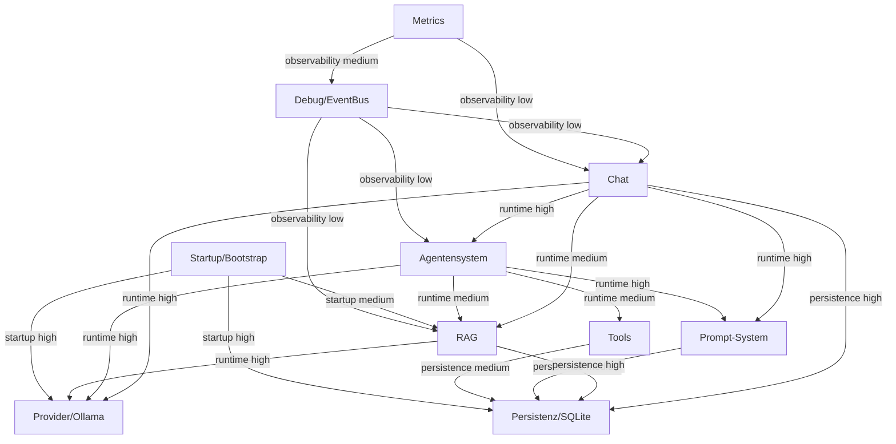

# QA Dependency Graph – Linux Desktop Chat

**Generiert:** `python scripts/qa/generate_qa_dependency_graph.py`  
**Zweck:** Karte der Subsystem-Abhängigkeiten und Kaskadenpfade.

---

## 1. Zweck

Der Dependency Graph zeigt:

- **Abhängigkeiten:** Welches Subsystem hängt von welchem ab?
- **Kaskaden:** Wenn A fehlschlägt, welche anderen sind mitbetroffen?
- **QA-Hebel:** Welche Subsysteme haben die größte Kaskaden-Reichweite?

---

## 2. Leselogik

| Pfeil | Bedeutung |
|-------|-----------|
| **A → B** | A hängt von B ab |
| **Wenn B fehlschlägt** | A ist mitbetroffen |

| Kanten-Typ | Bedeutung |
|------------|-----------|
| runtime | Laufzeit-Abhängigkeit (LLM, RAG, Agent) |
| startup | Startreihenfolge, Bootstrap |
| persistence | Datenbank, Chroma, SQLite |
| observability | Debug, Metrics, EventBus |

| Impact | Bedeutung |
|--------|-----------|
| high | Kritisch – Fehler blockiert oder beeinträchtigt stark |
| medium | Deutlich spürbar |
| low | Geringe Auswirkung |

---

## 3. Mermaid-Graph

---

## 4. Wichtigste Abhängigkeiten

- **runtime**: Chat → Provider/Ollama (high); Chat → RAG (medium); Chat → Agentensystem (high); Chat → Prompt-System (high); Agentensystem → Provider/Ollama (high)
- **startup**: Startup/Bootstrap → Provider/Ollama (high); Startup/Bootstrap → RAG (medium); Startup/Bootstrap → Persistenz/SQLite (high)
- **persistence**: Chat → Persistenz/SQLite (high); RAG → Persistenz/SQLite (medium); Prompt-System → Persistenz/SQLite (high); Tools → Persistenz/SQLite (medium)
- **observability**: Debug/EventBus → Chat (low); Debug/EventBus → Agentensystem (low); Debug/EventBus → RAG (low); Metrics → Debug/EventBus (medium); Metrics → Chat (low)

---

## 5. Kritischste Kaskadenpfade

1. **Provider/Ollama** fehlschlägt → Agentensystem, Chat, Debug/EventBus, Metrics, RAG, Startup/Bootstrap mitbetroffen
2. **Persistenz/SQLite** fehlschlägt → Agentensystem, Chat, Debug/EventBus, Metrics, Prompt-System, RAG, Startup/Bootstrap, Tools mitbetroffen
3. **Startup/Bootstrap** fehlschlägt → (App startet nicht – alle Subsysteme blockiert)

---

## 6. Top-3 QA-Hebel aus dem Dependency Graph

1. **Persistenz/SQLite**: Failure-Tests für DB-Lock, Schema-Drift
2. **Provider/Ollama**: Contract für Ollama-Response, degraded_mode ohne Ollama
3. **RAG**: Embedding-Service Failure, ChromaDB Netzwerk

---

## 7. Quellen

| Quelle | Inhalt |
|--------|--------|
| [QA_RISK_RADAR.md](QA_RISK_RADAR.md) | Subsystem-Liste |
| [docs/architecture.md](../architecture.md) | Datenfluss |
| Risk Radar Begründungen | Cross-Layer, Abhängigkeiten |

---

## 8. Empfehlung für QA Dependency Graph Iteration 2

| Priorität | Schritt | Nutzen |
|-----------|---------|--------|
| 1 | Automatisches Parsen aus Architektur-Docs | Graph aktuell halten |
| 2 | Impact-Scores pro Kaskadenpfad | Priorisierung verfeinern |
| 3 | Verknüpfung mit QA_PRIORITY_SCORE | Abhängigkeiten in Priorisierung einbeziehen |

---

*Generiert durch scripts/qa/generate_qa_dependency_graph.py*
